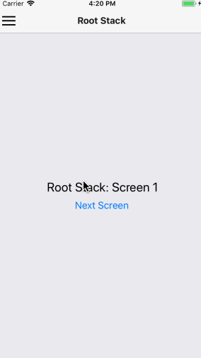

# Simple React Drawer Navigation Example

My simple example to show how to structure a React Native app with createDrawerNavigator and createStackNavigator (from reactnavigation.org).

App walkthrough:

For ease of understanding, code components are all in <b><a href="App.js">App.js</a></b>!

 1. The TouchableMenuIcon will always be displayed on the top-left hand side of the app
 2. Touching the menu icon opens up the SideMenu which you can style however you want
 3. A navigation stack RootStack holds the 3 screens in this example
 4. MyDrawerNavigator wraps the root stack and makes the side menu show up!

Setup commands:

 * npm install react-navigation --save
 * npm install
 * react-native run-ios

I went through a lot of other examples (many which didn't work as of July 2018) to come up with this one. Hopefully it will work when you try it out!

